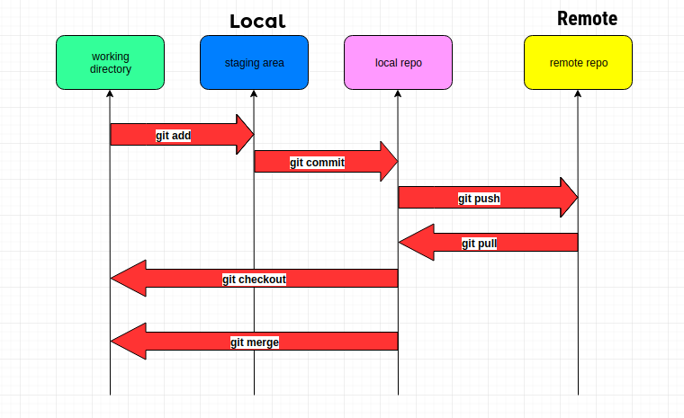
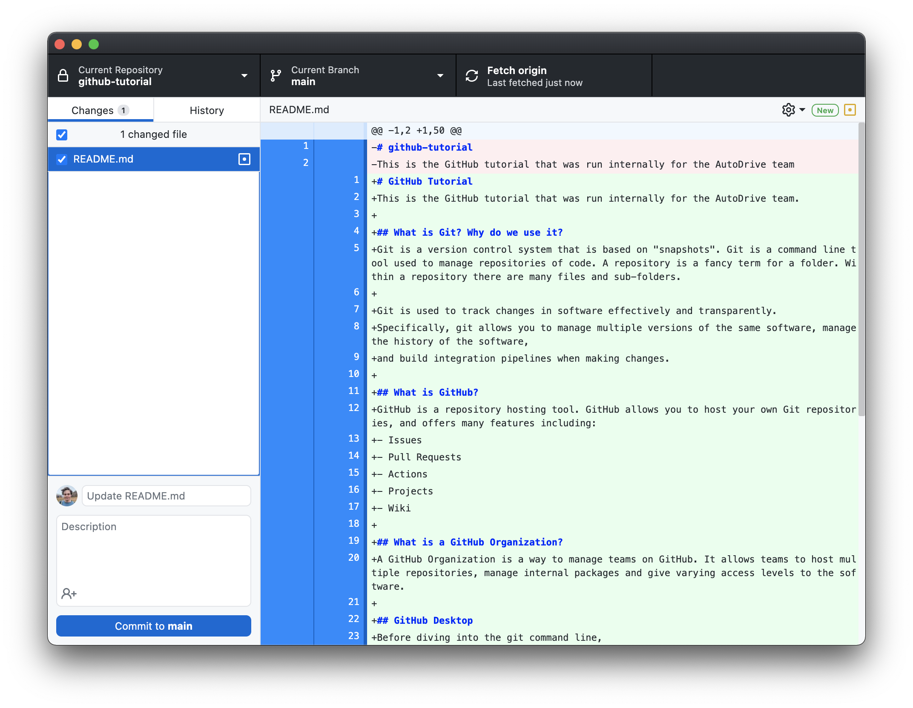

# GitHub Tutorial
This is the GitHub tutorial that was run internally for the AutoDrive team.

## What is Git? Why do we use it?
Git is a version control system that is based on "snapshots". Git is a command line tool used to manage repositories of code. A repository is a fancy term for a folder. Within a repository there are many files and sub-folders. 

Git is used to track changes in software effectively and transparently. 
Specifically, git allows you to manage multiple versions of the same software, manage the history of the software, 
and build integration pipelines when making changes.

## What is GitHub?
GitHub is a repository hosting tool. GitHub allows you to host your own Git repositories, and offers many features including:
- Issues
- Pull Requests
- Actions
- Projects
- Wiki

## What is a GitHub Organization?
A GitHub Organization is a way to manage teams on GitHub. It allows teams to host multiple repositories, manage internal packages and give varying access levels to the software.

## Terminology
- Main Branch - This is the default branch for a repository. Code on the main branch is **always** working.
- Repository - A collection of files that make up a codebase.
    - Local Repository - This is the code on your computer.
    - Remote Repository - This is the code on GitHub.
- Branch - A specific version of the files.
    - Local Branch - This is a branch on your computer.
    - Remote Branch - This is the branch on GitHub.
- Pull Request - This is a request to have a number of changes merged to the main branch. This is also the process of having code reviewed and tested before it gets merged to the main branch.


## Git Workflow
Our team will follow the following workflow:
- Create a new branch based on your current task
    - This branch should line up with a Jira ticket
- Write your code
- Push your code to your branch
- Open a Pull Request for your changes
    - This may trigger a CI/CD pipeline
- Request review from your teammates
    - We want to ensure that code is high quality
    - We will enforce a minimum of 2 reviewers on all changes
    - Some changes may require a meeting
- Merge your changes! 🎉

#### The Staging Area
Something that people often get confused about with Git is what's known as the ***Staging Area***. When you are writing your code locally, your changes won't appear on the remote until you push them. However, there is a middle ground which is the staging area. Whenever you perform `git add`, your changes are moved into the staging area. `git commit` publishes your changes to your local repository. `git push` syncs your local repository with the remote repository. 

The following diagram is a useful way of visualizing this process:



## GitHub Desktop
Before diving into the git command line, it's worth talking about GitHub desktop first. 
If you're new to using Git, GitHub desktop will be a much easier way to work, but its features are limited.

This is what GitHub desktop looks like: 



## Installing Git Bash
Before using the Git command line tool, you'll need to ensure that you have a bash terminal on your machine. Git can be installed from the <a href='https://git-scm.com/download/'>git-scm website</a>.

## Exit Ticket
Please create a new file in the `people` folder of this repository that is: `<firstName>-<lastName>.md` and submit a pull request. 

## Basic Git Commands
This section covers the basic git commands that you will use most often. 

### `git clone`
This command is used to clone a repository. You can clone a repository with either https or ssh. The syntax looks like this: 
```
git clone <github-repository-url>
```


### `git status`
This command is used to view the status of your changes on git. It will show you what files you have changed locally, as well as how many commits ahead/behind the current branch you are. The syntax is: 
```
git status
```


### `git add`
This is how you move your local changes into the staging area. The syntax is:
```
git add <files>
```

You can add multiple files, like so: 
```
git add file1 file2 file3 ...etc.
```

You can also add all files: 
```
git add .
```

### `git commit`
Git commit is how you package your changes into a single change, known as a commit. You must always add a commit message with your commit. The syntax is: 
```
git commit -m 'your message here'
```
**Note**: This will only publish the files in the staging area. Local files that haven't been added will not be included in the commit. If this happens (it will), you can ***amend*** your commit:
```
git commit --amend
```

Commit messages are important. They are how we will track changes to our codebase over time. Please ensure that you write useful commit messages when merging to the main development branch!


Our team will use a custom commit message structure for Jira tickets:
```
git commit -m '<TICKET_ID> <message>'
```

For example:
```
git commit -m 'AUTODRIVE-99 updates LiDAR interface'
```

### `git push`
Git Push is how you will sync your local changes with the remote repository. When you've made changes, you will use this command to push them to GitHub. The syntax is: 
```
git push
```

If your local branch doesn't exist on the remote yet, you will need to set the upstream tracking branch. The syntax is: 
```
git push --set-upstream origin <your-branch-name>
```

or more concisely:
```
git push -u origin <your-branch-name>
```

### `git pull`
Git Pull is how you will pull changes from the remote to your local repository. For example:
- Hannah is working on some high-tech stuff locally
- Brent just merged a change on Git 
- Now, Hannahs local repository is "behind", because she doesn't have the recently merged change.
- Hannah does `git pull` to pull in the changes. 

**Note**: Sometimes you will have conflicts. For example, if Brent made a change that was in the same files Hannah was working on. VSCode has a nice conflict managing system. 

### `git checkout`
Git Checkout is very versatile. Most of the time, it will be used to switch between branches. The syntax is: 
```
git checkout <branch-name>
```

If you're creating a new branch, you must add the `-b` flag. 
```
git checkout -b <new-branch>
```

You can also checkout specific commits. Let's say you wanted to go to a specific point in your git history, you would do:
```
git checkout <commit-sha>
```


## Intermediate Git Commands
- `git fetch`
- `git log`
    - Additional options!
    - `git log --oneline --graph`
    - `git log --stat`
    - `git log --grep <string>`
- `git rebase`
- `git stash`


## Advanced Git Commands
- `git reflog`
    - similar to git log
    - "reference log"
- `git cherry-pick`
- `git diff`

